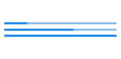

# Material Design Android Library

<a href="https://play.google.com/store/apps/details?id=com.gc.demomaterialdesign">
  
</a>


[](https://android-arsenal.com/details/1/1156)

* [How to use](#howtouse)
* [Components](#components)
    * [Buttons](#buttons)
        * [Flat Button](#flat-button)
        * [Rectangle Button](#rectangle-button)
        * [Float Button](#float-button)
        * [Float small button](#float-small-button)
    * [Switches](#switches)
        * [CheckBox](#checkbox)
        * [Switch](#switch)
    * [Progress indicators](#progress-indicators)
        * [Progress bar circular indeterminate](#progress-bar-circula-rindeterminate)
        * [Progress bar indeterminate](#progress-bar-indeterminate)
        * [Progress bar indeterminate determinate](#progress-bar-indeterminate-determinate)
        * [Progress bar determinate](#progress-bar-determinate)
        * [Slider](#slider)
        * [Slider with number indicator](#slider-with-number-indicator)
* [Widgets](#widgets)
    * [SnackBar](#snackbar)
    * [Dialog](#dialog)
    * [Color selector](#color-selector)

## How to use

If you want use this library, you only have to download MaterialDesign project, import it into your workspace and add the project as a library in your android project settings.

If you prefer it, you can use the gradle dependency, you have to add these lines in your build.gradle file:

```xml
repositories {
    jcenter()
}

dependencies {
    compile 'com.github.navasmdc:MaterialDesign:1.5@aar'
}
```

Some components have custom attributes, if you want use them, you must add this line in your xml file in the first component:

```xml
<RelativeLayout xmlns:android="http://schemas.android.com/apk/res/android"
    xmlns:materialdesign="http://schemas.android.com/apk/res-auto"
    android:layout_width="match_parent"
    android:layout_height="match_parent"
    >
</RelativeLayout>
```

>If you are going to use a ScrollView, it is recommended that you use the CustomScrollView provided in this library to avoid problems with the custom components.
>To use this component:
>```xml
><com.gc.materialdesign.views.ScrollView 
>    xmlns:android="http://schemas.android.com/apk/res/android"
>    xmlns:materialdesign="http://schemas.android.com/apk/res-auto"
>    android:id="@+id/scroll"
>    android:layout_width="match_parent"
>    android:layout_height="match_parent">
></com.gc.materialdesign.views.ScrollView>
>```

##Components

####Buttons

######Flat Button


```xml
<com.gc.materialdesign.views.ButtonFlat
                android:id="@+id/buttonflat"
                android:layout_width="wrap_content"
                android:layout_height="wrap_content"
                android:background="#1E88E5"
                android:text="Button" />
```

######Rectangle Button


```xml
<com.gc.materialdesign.views.ButtonRectangle
                android:id="@+id/button"
                android:layout_width="wrap_content"
                android:layout_height="wrap_content"
                android:background="#1E88E5"
                android:text="Button" />
```

######Float Button


>It is recommended to put this component in the right-bottom of the screen. To use this component write this code in your xml file.
>If you don`t want to start this component with animation set the animate attribute to false.
>Put your icon in the icon attribute to set the drawable icon for this component.

```xml
<RelativeLayout xmlns:android="http://schemas.android.com/apk/res/android"
    xmlns:materialdesign="http://schemas.android.com/apk/res-auto"
    android:layout_width="match_parent"
    android:layout_height="match_parent"
    >
    <!-- ... XML CODE -->
    <com.gc.materialdesign.views.ButtonFloat
                android:id="@+id/buttonFloat"
                android:layout_width="wrap_content"
                android:layout_height="wrap_content"
                android:layout_alignParentRight="true"
                android:layout_alignParentBottom="true"
                android:layout_marginRight="24dp"
                android:background="#1E88E5"
                materialdesign:animate="true"
                materialdesign:iconDrawable="@drawable/ic_action_new" />
</RelativeLayout>
```

######Float small button


```xml
<com.gc.materialdesign.views.ButtonFloatSmall
                android:id="@+id/buttonFloatSmall"
                android:layout_width="wrap_content"
                android:layout_height="wrap_content"
                android:background="#1E88E5"
                materialdesign:iconDrawable="@drawable/ic_action_new" />
```

####Switches

######CheckBox


```xml
<com.gc.materialdesign.views.CheckBox
                android:id="@+id/checkBox"
                android:layout_width="wrap_content"
                android:layout_height="wrap_content"
                android:background="#1E88E5"
                android:text="CheckBox"
                materialdesign:check="true" />
```

######Switch


```xml
<com.gc.materialdesign.views.Switch
                android:id="@+id/switchView"
                android:layout_width="wrap_content"
                android:layout_height="wrap_content"
                android:background="#1E88E5"
                materialdesign:check="true" />
```

####Progress indicators

######Progress bar circular indeterminate


```xml
<com.gc.materialdesign.views.ProgressBarCircularIndeterminate
                android:id="@+id/progressBarCircularIndeterminate"
                android:layout_width="32dp"
                android:layout_height="32dp"
                android:background="#1E88E5" />
```

######Progress bar indeterminate


```xml
<com.gc.materialdesign.views.ProgressBarIndeterminate
                android:id="@+id/progressBarIndeterminate"
                android:layout_width="fill_parent"
                android:layout_height="wrap_content"
                android:background="#1E88E5" />
```

######Progress bar indeterminate determinate


```xml
<com.gc.materialdesign.views.ProgressBarIndeterminateDeterminate
                android:id="@+id/progressBarIndeterminateDeterminate"
                android:layout_width="fill_parent"
                android:layout_height="wrap_content"
                android:background="#1E88E5" />
```

>If you begin progrees, you only have to set progress it
>
>```java
>progressBarIndeterminateDeterminate.setProgress(progress);
>```

######Progress bar determinate



```xml
<com.gc.materialdesign.views.ProgressBarDeterminate
                android:id="@+id/progressDeterminate"
                android:layout_width="fill_parent"
                android:layout_height="wrap_content"
                android:background="#1E88E5" />
```

>You can custom max and min progress values with `materialdesign:max="50"` and `materialdesign:min="25"` attributes.

######Slider


```xml
<com.gc.materialdesign.views.Slider
                android:id="@+id/slider"
                android:layout_width="fill_parent"
                android:layout_height="wrap_content"
                android:background="#1E88E5"
                materialdesign:max="50"
                materialdesign:min="0"
                 />
```

######Slider with number indicator


```xml
<com.gc.materialdesign.views.Slider
                android:id="@+id/slider"
                android:layout_width="fill_parent"
                android:layout_height="wrap_content"
                android:background="#1E88E5"
                materialdesign:max="50"
                materialdesign:min="0"
                materialdesign:showNumberIndicator="true"/>
```

##Widgets

####SnackBar


```java
SnackBar snackbar = new SnackBar(Activity activity, String text, String buttonText, View.OnClickListener onClickListener);
snackbar.show();
```

> If you don't want to show the button, put `null` in `buttonText` attribute

####Dialog


```java
Dialog dialog = new Dialog(Context context,String title, String message);
dialog.show();
```

>You can set the accept and cancel button on the event listener or change it's text
>```java
> // Set accept click listenner
>dialog.setOnAcceptButtonClickListener(View.OnClickListener onAcceptButtonClickListener);
> // Set cancel click listenner
>dialog.setOnCancelButtonClickListener(View.OnClickListener onCancelButtonClickListener);
> // Acces to accept button
>ButtonFlat acceptButton = dialog.getButtonAccept();
> // Acces to cancel button
>ButtonFlat cancelButton = dialog.getButtonCancel();
>```

####Color selector


```java
ColorSelector colorSelector = new ColorSelector(Context context,int intialColor, OnColorSelectedListener onColorSelectedListener);
colorSelector.show();
```


